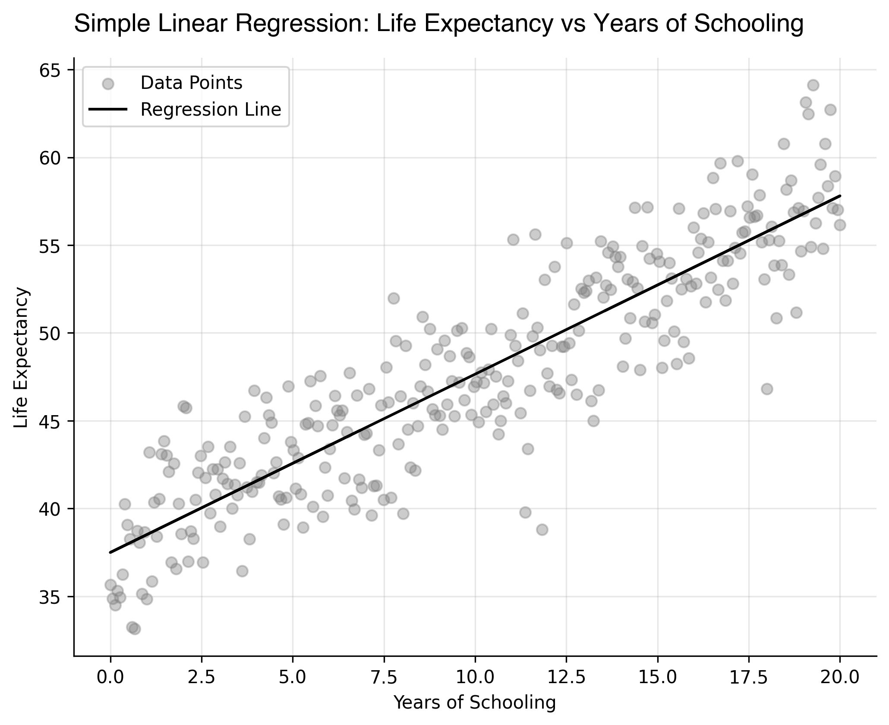

# Linear Regression
## The Basic Algorithm of Supervised Learning

## 1. Introduction

Linear regression is one of the simplest, yet most fundamental, algorithms in supervised learning, and it is specifically designed to address *regression* problems. To be precise, supervised learning comprises two main classes of prediction tasks: *regression* and classif*ication, which differ by the nature of the variable to be predicted.

A regression task consists in predicting a continuous numerical variable, such as fuel efficiency (`mpg`), income, or temperature. By contrast, a classification task aims to assign observations to a finite set of discrete categories (e.g. dog vs. cat). A common special case is *binary classification*, where the target variable takes only two possible values, often encoded as $0$ and $1$ (for instance, whether a patient tests positive or negative for a given disease).

In this chapter, the focus is exclusively on regression problems. Linear regression provides a baseline yet powerful framework for modeling the relationship between a set of explanatory variables and a continuous response variable, and serves as a conceptual and mathematical foundation for many more advanced methods in statistical learning. Finally, I repeat that most of my writings are heavily inspired by Hastie et al. (2009), unless explicitely mentioned otherwise.

## 2. The Simple Linear Regression

### Model Specification

The simple linear regression (SLR) framework is very straightforward.
our purpose is to find a relationship that allows us to explain the behavior of $Y$, the target (random) variable, in function of $X$, the independent (random) variable. Therefore, our model takes the form:

$$
Y = \beta_0 + \beta_1 X + \varepsilon
$$

where $\beta_0$ and $\beta_1$ are the *coefficients* of the model and $\varepsilon$ is the random error term with expected value of $0$. Once this model has been established, one can legitimaly ask the question, how do we produce predictions? First, we use *training data* to estimate the model's coefficients: $\hat{\beta}_0$ and $\hat{\beta}_1$ (the hat denotes estimated quantities). Then, we predict the value $\hat y$ with a new (e.g., the test set) set of predictors $x$:

$$
\hat y = \hat{\beta}_0 + \hat{\beta}_1 x
$$

### Computing the Coefficients

Once $\hat y$ has been predicted, one can compute the squared sum of the *residuals* (RSS) as:

$$
\mathrm{RSS} = \sum_{i = 1}^{n} e_i^2 = \sum_{i = 1}^{n} (y_i - \hat{y}_i)^2
$$

And to estimate the two coefficients $\hat{\beta}_0$ and $\hat{\beta}_1$, we now minimize the RSS (the MSE since we take the mean) on the training data:

$$
\min_{\hat{\beta}_0, \hat{\beta}_1} \quad \frac{1}{n} \sum_{i = 1}^{n} (y_i - \hat{y}_i)^2
$$

which is the same as:

$$
\min_{\hat{\beta}_0, \hat{\beta}_1} \quad \frac{1}{n} \sum_{i = 1}^{n}
(y_i - \hat{\beta}_0 - \hat{\beta}_1 x_i)^2
$$

and with some calculus steps, one can easily find that:

$$
\hat{\beta}_1 = \frac{\overline{xy} - \overline{x} \cdot \overline{y}}{\overline{x^2} - \overline{x}^2}, \qquad
\hat{\beta}_0 = \overline{y} - \hat{\beta}_1 \overline{x}
$$

where $\overline{xy} = 1/n \cdot \sum_{i=1}^{n} x_i y_i$, $\overline{x} = 1/n \cdot \sum_{i=1}^{n} x_i$ (same for $\overline{y}$), then $\overline{x^2} = 1/n \cdot \sum_{i=1}^{n} x_i^2$, and finally $\overline{x}^2 = \bigl( 1/n \cdot \sum_{i=1}^{n} x_i \bigr)^2$.

### Synthetic Example

To visually and computationally demonstrate the results we obtained above, I create a synthetic data set composed of two variables: `life_exp`, and `yrs_school` (based on real empirical observations). This data set is available [here](data/life_expectancy_data.csv) and it is constructed as:

```text
   yrs_school   life_exp
0   13.578595  52.713117
1   17.792642  57.841715
2   10.167224  47.758930
3    0.602007  33.257639
4   15.585284  57.082617
```

Now, we are going to assume that the variable `yrs_school` is our random variable $X$ and `life_exp` is the random variable $Y. We first code a function to compute the coefficient of the SLR:

```python
def SLR_coefficients(X, y):
    """
    Calculate the coefficients for Simple Linear Regression.
    
    Parameters:
    X (array-like): Independent variable.
    y (array-like): Dependent variable.
    
    Returns:
    tuple: Intercept and slope of the regression line.
    """
    n = len(X)
    
    # Calculate slope
    num = np.sum(X * y) - n * np.mean(X) * np.mean(y)
    den = np.sum(X**2) - n * (np.mean(X))**2
    b1 = num / den  # slope

    # Calculate intercept
    b0 = np.mean(y) - b1 * np.mean(X)  # intercept
    
    return b0, b1
```

And if we compute the coefficients, we obtain:

```text
SLR Coefficients
Intercept (b0): 37.494628041499226
Slope (b1): 1.0155605359752424
```
and since this is not very compelling alone, we also realize a regression line with those exact same coefficients to see how well we fit the data (Fig. 1).

<figure style = "text-align: center;">
    
    <figcaption>
        <strong>Fig. 1</strong> Manually computed regression line on synthetic data. (Simple linear regression).
    </figcaption>
</figure>


## References

- Hastie, T., Tibshirani, R., & Friedman, J. (2009). *An introduction to statistical learning*.